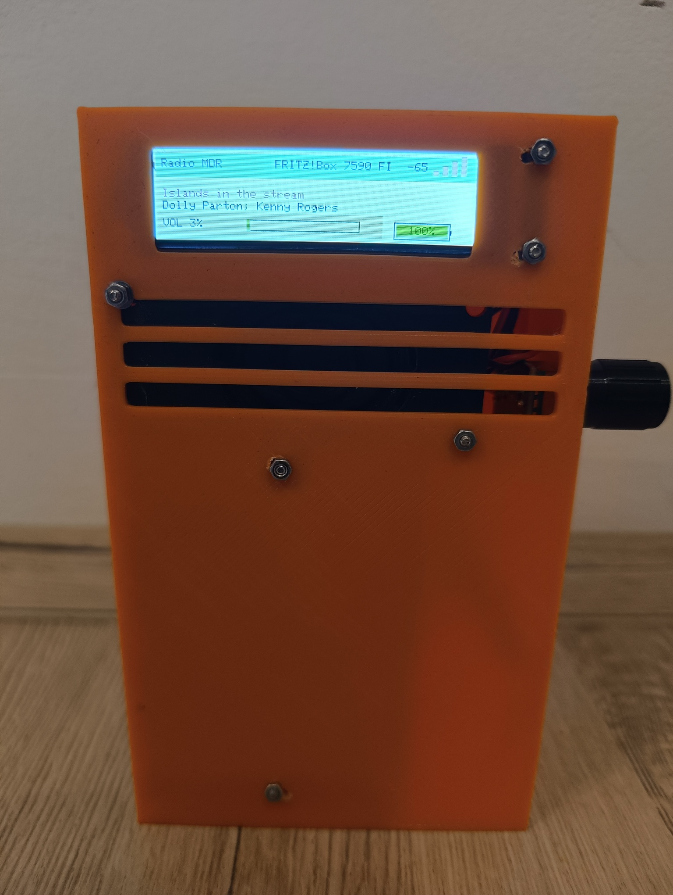

# ESP32 Internet Radio


Ein kompaktes Internetradio auf Basis eines ESP32 mit 2,25"-TFT-Display, Drehencoder, I2S-Audioausgabe und Akkuanzeige.

Das Radio empfängt Internetradio-Streams über WLAN und gibt die MP3-Audiodaten über eine I2S-Audioschnittstelle aus.

Die Bedienung erfolgt direkt am Gerät über einen Drehencoder. Zusätzlich besitzt das Radio einen integrierten Webserver, über den WLAN-Einstellungen, Senderliste und Lautstärke konfiguriert werden können.

## Funktionen

* Internetradio über WLAN
* MP3-Streaming
* 2,25"-ST7789-TFT-Display
* 240 × 320 Pixel
* Lautstärkeregelung über Drehencoder
* Senderwechsel über Druck auf den Drehencoder
* Anzeige des aktuellen Senders
* Anzeige von Stream-Titelinformationen
* Anzeige der WLAN-Signalstärke
* Akku-Ladezustandsanzeige
* Speicherung der WLAN-Daten im LittleFS
* Speicherung der Senderliste im LittleFS
* integrierter Webserver
* Konfiguration über Weboberfläche
* WLAN-Einstellungen über Weboberfläche ändern
* Sender hinzufügen und löschen
* Sender-URLs ändern
* Lautstärke über Weboberfläche einstellen
* Neustart über Weboberfläche
* eigener WLAN Access Point zur Konfiguration

## Hardware

### Controller

* ESP32 DEVKIT

### Display

* ST7789
* 2,25"
* 240 × 320 Pixel
* SPI

### Audio

Die Audioausgabe erfolgt über I2S.

### Drehencoder

Ein Drehencoder übernimmt die Bedienung des Radios.

* Drehen → Lautstärke ändern
* Drücken → nächsten Sender auswählen

### Akku

Die Akku-Spannung wird über einen analogen Eingang des ESP32 gemessen und als Ladezustand auf dem Display dargestellt.

## Pinbelegung

### ESP32 → TFT

| ESP32 GPIO | Funktion |
| ---------: | -------- |
|    GPIO 18 | TFT SCLK |
|    GPIO 23 | TFT MOSI |
|     GPIO 5 | TFT CS   |
|     GPIO 2 | TFT DC   |
|     GPIO 4 | TFT RST  |

MISO wird beim verwendeten Display nicht benötigt.

### ESP32 → I2S Audio

| ESP32 GPIO | Funktion  |
| ---------: | --------- |
|    GPIO 26 | I2S BCLK  |
|    GPIO 25 | I2S LRCLK |
|    GPIO 22 | I2S DIN   |

### ESP32 → Drehencoder

| ESP32 GPIO | Funktion            |
| ---------: | ------------------- |
|    GPIO 17 | Encoder A / CLK     |
|    GPIO 16 | Encoder B / DT      |
|    GPIO 27 | Encoder Taster / SW |

### Akku

| ESP32 GPIO | Funktion              |
| ---------: | --------------------- |
|    GPIO 34 | Akku-Spannungsmessung |

## Übersicht

```text
                         ESP32 DEVKIT
                              │
             ┌────────────────┼────────────────┐
             │                │                │
             ▼                ▼                ▼
        ST7789 TFT       Drehencoder       I2S Audio
        240 × 320          A / B / SW       BCLK  → GPIO26
             │                              LRCLK → GPIO25
             │                              DIN   → GPIO22
             │
             ▼
         Display

        GPIO34
           │
           ▼
      Akku-Messung
```

## Software

Das Projekt wurde mit der Arduino IDE entwickelt.

Verwendete Versionen laut Projektstand:

* ESP32 Board Package: 2.0.14
* ESP8266Audio: 1.9.7
* TFT_eSPI
* LittleFS

## Verwendete Bibliotheken

Der Sketch verwendet unter anderem:

```cpp
#include <WiFi.h>
#include <WebServer.h>
#include <TFT_eSPI.h>
#include "AudioFileSourceICYStream.h"
#include "AudioFileSourceBuffer.h"
#include "AudioGeneratorMP3.h"
#include "AudioOutputI2S.h"
#include <SPI.h>
#include <FS.h>
#include <LittleFS.h>
```

Für die Audio-Wiedergabe wird die Bibliothek **ESP8266Audio** verwendet.

## TFT_eSPI

Das Display verwendet einen ST7789-Treiber.

Die Konfiguration befindet sich in:

```text
User_Setup.h
```

Wichtige Einstellungen:

```cpp
#define ST7789_DRIVER

#define TFT_WIDTH  240
#define TFT_HEIGHT 320

#define TFT_MOSI 23
#define TFT_SCLK 18

#define TFT_CS   5
#define TFT_DC   2
#define TFT_RST  4

#define SPI_FREQUENCY 40000000
```

Zusätzlich wird `CGRAM_OFFSET` verwendet.

## LittleFS

Das Radio verwendet **LittleFS**, um Konfigurationsdaten dauerhaft im ESP32 zu speichern.

Es werden zwei Dateien verwendet:

```text
wifi.txt
stations.txt
```

### WLAN-Konfiguration

Die Datei `wifi.txt` hat folgendes Format:

```text
ssid=MEIN_WLAN
password=MEIN_PASSWORT
```

Im GitHub-Projekt befindet sich deshalb nur:

```text
data/wifi.txt.example
```

Diese Datei dient als Vorlage.

**Die persönlichen WLAN-Zugangsdaten dürfen nicht in das öffentliche GitHub-Repository hochgeladen werden.**

Für die tatsächliche Verwendung muss aus der Vorlage eine persönliche `wifi.txt` erstellt werden.

## Senderliste

Die Senderliste befindet sich in:

```text
stations.txt
```

Das Format ist:

```text
Sendername;Stream-URL
```

Beispiel:

```text
Radio MDR;http://...
Radio SAW;http://...
Deutschlandfunk;http://...
```

Im Projekt können bis zu 20 Sender verwaltet werden.

Die Senderliste kann später auch über die Weboberfläche geändert werden.

## Bedienung

### Lautstärke

Den Drehencoder drehen:

* rechts → Lautstärke erhöhen
* links → Lautstärke verringern

Die Lautstärke wird zwischen 0 und 100 % geregelt.

### Senderwechsel

Druck auf den Drehencoder wählt den nächsten Sender.

Nach dem letzten Sender wird wieder der erste Sender ausgewählt.

## Display

Das Display zeigt unter anderem:

* aktuellen Sender
* WLAN-SSID
* WLAN-Signalstärke
* Titelinformationen des Streams
* Lautstärke
* Akku-Ladezustand

Wenn der Stream Titelinformationen liefert, werden diese automatisch übernommen.

## Weboberfläche

Der ESP32 stellt einen integrierten Webserver zur Verfügung.

Die Startseite zeigt:

* WLAN-SSID
* IP-Adresse
* aktuellen Sender
* Lautstärke

Über die Weboberfläche stehen folgende Funktionen zur Verfügung:

### WLAN

WLAN-SSID und Passwort können geändert werden.

Nach dem Speichern startet der ESP32 neu.

### Sender

Die Senderliste kann bearbeitet werden.

Möglich sind:

* Sendername ändern
* Stream-URL ändern
* Sender löschen
* neuen Sender hinzufügen

### Lautstärke

Die Lautstärke kann über einen Schieberegler eingestellt werden.

### Nächster Sender

Der nächste Sender kann direkt über die Weboberfläche ausgewählt werden.

### Neustart

Der ESP32 kann über die Weboberfläche neu gestartet werden.

## Access Point

Das Radio arbeitet gleichzeitig als WLAN-Station und Access Point.

Beim Start wird ein eigener Access Point bereitgestellt:

```text
SSID: ESP32-Radio
Passwort: 12345678
```

Der Access Point dient zur Konfiguration des Radios.

Die IP-Adresse des Access Points wird beim Start über die serielle Schnittstelle ausgegeben.

## Installation

### 1. Arduino IDE

Arduino IDE installieren und die ESP32-Boardunterstützung einrichten.

### 2. Bibliotheken installieren

Folgende Bibliotheken werden benötigt:

* TFT_eSPI
* ESP8266Audio

Die im Sketch verwendeten ESP32-Systembibliotheken sind Bestandteil der ESP32-Umgebung.

### 3. TFT_eSPI konfigurieren

Die Datei:

```text
User_Setup.h
```

aus diesem Repository für die TFT_eSPI-Konfiguration verwenden.

Das Display muss als ST7789 mit 240 × 320 Pixeln konfiguriert werden.

### 4. WLAN konfigurieren

Die Datei:

```text
data/wifi.txt.example
```

als Vorlage verwenden.

Eine persönliche Datei:

```text
wifi.txt
```

erstellen:

```text
ssid=MEIN_WLAN
password=MEIN_PASSWORT
```

**Diese persönliche Datei nicht in ein öffentliches GitHub-Repository hochladen.**

### 5. Senderliste

Die Datei:

```text
data/stations.txt
```

enthält die Senderliste.

Jede Zeile besteht aus:

```text
Sendername;Stream-URL
```

### 6. LittleFS übertragen

Die Dateien aus dem `data`-Verzeichnis müssen in das LittleFS-Dateisystem des ESP32 übertragen werden.

Anschließend müssen im ESP32 vorhanden sein:

```text
/wifi.txt
/stations.txt
```

### 7. Sketch übertragen

Den Sketch:

```text
ESP32-Internet-Radio.ino
```

in der Arduino IDE öffnen und auf den ESP32 übertragen.

Nach dem Start kann die serielle Ausgabe mit 115200 Baud verwendet werden, um Informationen zum WLAN und Access Point anzuzeigen.

## Start

Nach dem Einschalten:

1. TFT wird initialisiert.
2. LittleFS wird gestartet.
3. WLAN-Konfiguration wird geladen.
4. Access Point `ESP32-Radio` wird gestartet.
5. WLAN-Verbindung wird hergestellt, sofern Daten vorhanden sind.
6. Senderliste wird geladen.
7. I2S-Audioausgabe wird initialisiert.
8. erster Sender wird gestartet.

## Akkuanzeige

Die Akku-Spannung wird über GPIO34 gemessen.

Die Software berechnet aus der gemessenen Spannung einen Ladezustand.

Der verwendete Bereich reicht von:

```text
6,60 V → 10 %
8,40 V → 100 %
```

Die Akkuanzeige kann bei Bedarf an den tatsächlich verwendeten Akku und Spannungsteiler angepasst werden.

## Beispiel-Sender

Im ursprünglichen Projekt sind unter anderem folgende Sender vorgesehen:

* Radio MDR
* Radio SAW
* MDR JUMP
* MDR SPUTNIK
* MDR KLASSIK
* R.SA
* Deutschlandfunk

Die Stream-URLs können sich ändern. Falls ein Sender nicht mehr funktioniert, kann die URL über die Weboberfläche geändert werden.

## Projektstatus

**Version 3.0**

Der aktuelle Entwicklungsstand beinhaltet:

* TFT-Display
* WLAN-Internetradio
* MP3-Streaming
* I2S-Audioausgabe
* Drehencoder
* Lautstärkeregelung
* Senderverwaltung
* LittleFS
* Webserver
* WLAN-Konfiguration
* eigenen Access Point
* Akkuanzeige

## Bilder

Ein Foto des fertigen Radios kann hier ergänzt werden:

```markdown

```

## Hinweise

Die im Projekt verwendeten Radio-Stream-URLs sind Beispiele und können sich ändern.

Für den Betrieb werden funktionierende Internet-Radio-Streams benötigt.

Das Projekt wurde für die im Repository dokumentierte Hardware und Softwarekonfiguration entwickelt.

## Version

**ESP32 Internet Radio – Version 3.0**
